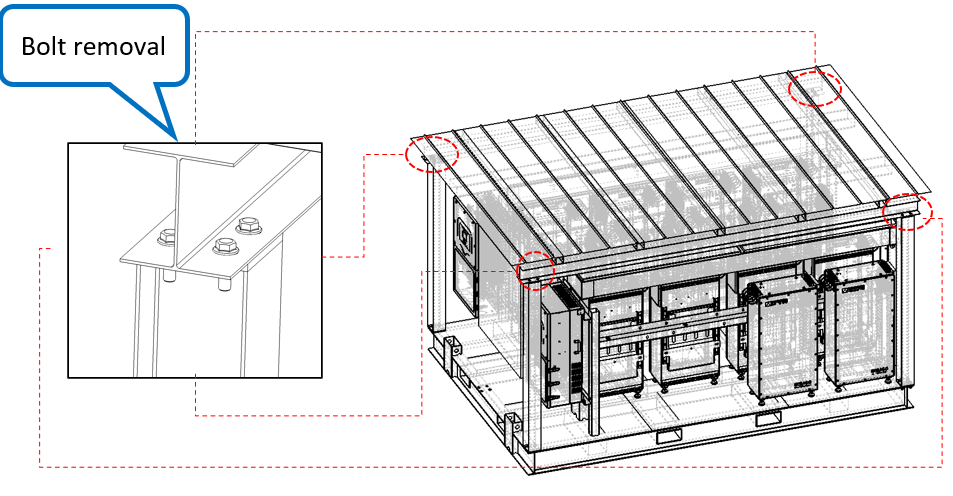
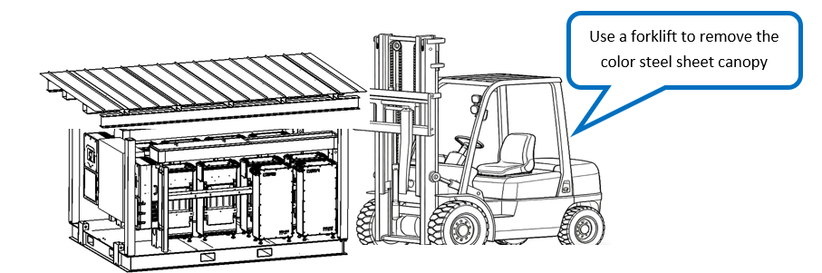
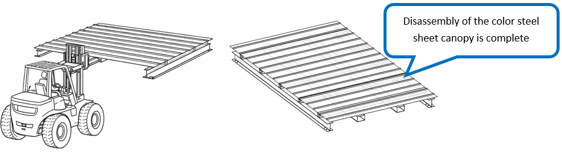

# 1. Remove Steel Roof Canopy

**Process Name**: Steel roof canopy removal

**Equipment**: Forklift

**Tools / PPE**: Electric wrench + 19mm socket, high-torque wrench, marker

**Parts List**
| Part No. | Part Name | Qty |
| --- | --- | --- |
|  | Steel roof canopy | 1 |
|  | M12 hex flange bolt | 16 |
|  | M12 hex flange nut | 16 |

**Steps**

1. Remove the four M12×40 hex flange bolts (A2-70 stainless) on each of the four columns in sequence with an electric wrench, as shown in Figure 1.

	

2. Insert the forklift forks into the square tubes on the canopy and lift it up, as shown in Figure 2.

	

3. Place the steel roof canopy in a safe location, as shown in Figure 3.

	

**Notes**

> 1. During forklift handling, keep a 1m safety zone around the lifting area. Keep the forklift running and do not lift the forks until all bolts are released. Operators must follow safety protection rules.
> 2. All bolts must be fully removed before lifting.
