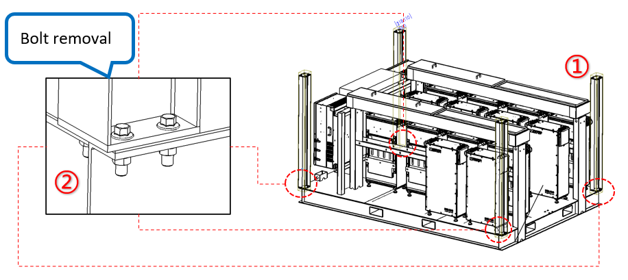
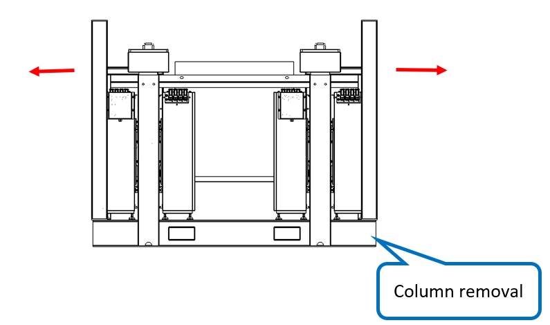
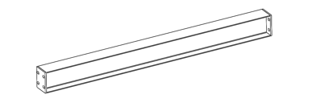

# 2. Remove Columns

**Process Name**: Tray canopy column removal

**Tools / PPE**: Electric wrench + 18mm socket, high-torque wrench, marker

**Parts List**
| Part No. | Part Name | Qty |
| --- | --- | --- |
| B1309900491 | Column | 4 |
|  | M12 hex flange bolt | 16 |
|  | M12 hex flange nut | 12 |

**Steps**

1. The tray uses 4 columns, each 1516mm long, as shown in Figure 1①.

2. Remove column bolts: as shown in Figure 1②, remove four M12×40 hex flange bolts (A2-70 stainless) in sequence using an electric wrench.

3. Remove the columns from the tray as shown in Figure 2.

**Notes**

> 1. Each corner of the tray has four bolt holes. One inner hole has a pre-welded M12 nut for installation convenience and does not need removal.
