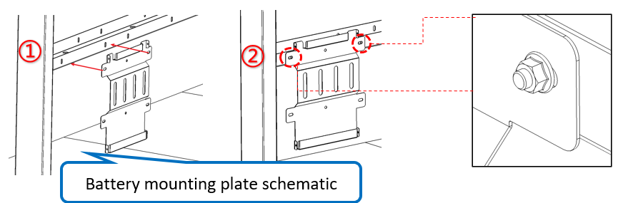
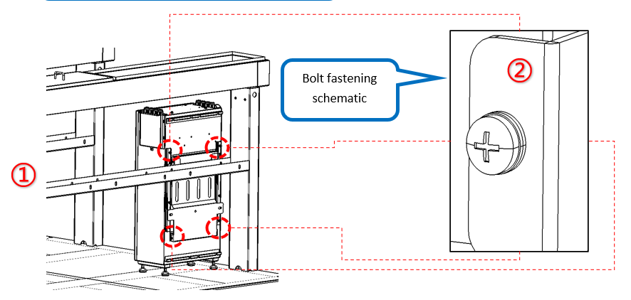

# 3. Install Batteries

**Process Name**: Battery installation

**Tools / PPE**: Electric wrench (12mm socket), Phillips screwdriver, high-torque wrench, marker

**Parts List**
| Part No. | Part Name | Qty |
| --- | --- | --- |
|  | Battery mounting plate | 14 |
|  | Battery | 14 |
|  | M10x25 hex flange bolt | 28 |
|  | M5x12 screw | 56 |

**Steps**

1. Mount battery plates:

   1. Align the mounting holes on the battery plate with the bracket holes as shown in Figure 1①.
   2. Fasten the two mounting positions with M10x25 hex flange bolts as shown in Figure 1②.

   

2. Install batteries:

   1. Align the battery with the plate holes as shown in Figure 2①.
   2. Use M5x12 screws to secure the battery at four positions as shown in Figure 2②.

   

**Notes**

> 1. The tray has 16 battery positions; only 14 batteries are required.
> 2. All screws must be fully tightened with no omissions or insufficient torque.
