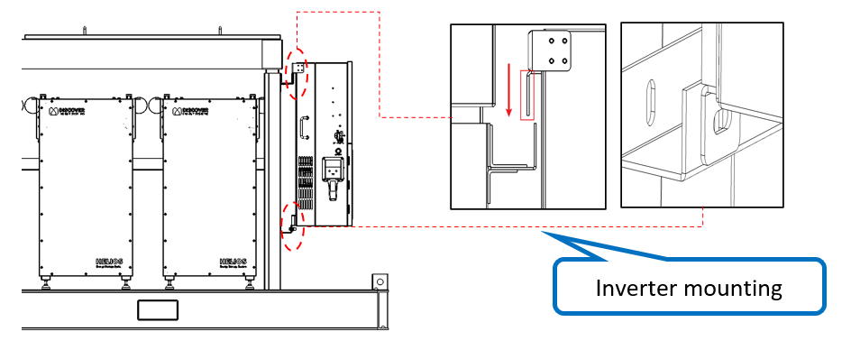
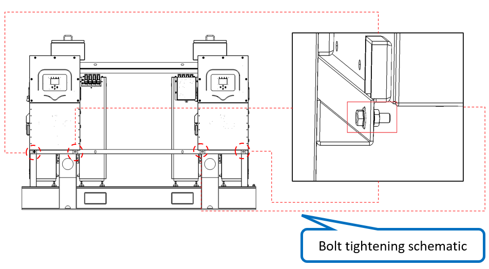

# 4. Install Inverters

**Process Name**: Inverter installation

**Tools / PPE**: Electric wrench (10mm socket), high-torque wrench, marker

**Parts List**
| Part No. | Part Name | Qty |
| --- | --- | --- |
|  | Inverter | 2 |
|  | M8x25 hex flange bolt | 4 |
|  | M8x25 hex flange nut | 4 |

**Steps**

1. Hang the inverter on the upper bracket slot as shown in Figure 1.

   

2. Align the lower inverter mounting hole with the lower bracket slot as shown in Figure 2.

   

3. Fasten the inverter with M10 hex flange bolts, torque 42Nm, as shown in Figure 3.

   

**Notes**

> 1. Make sure the hook engages the upper slot to avoid falling.
> 2. All bolts must be fully tightened with no omissions or insufficient torque.
