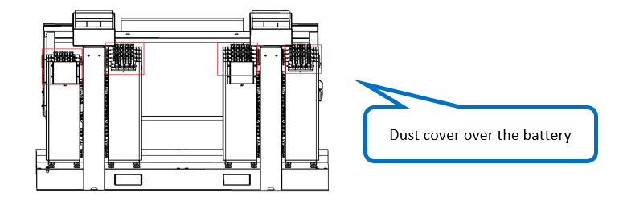
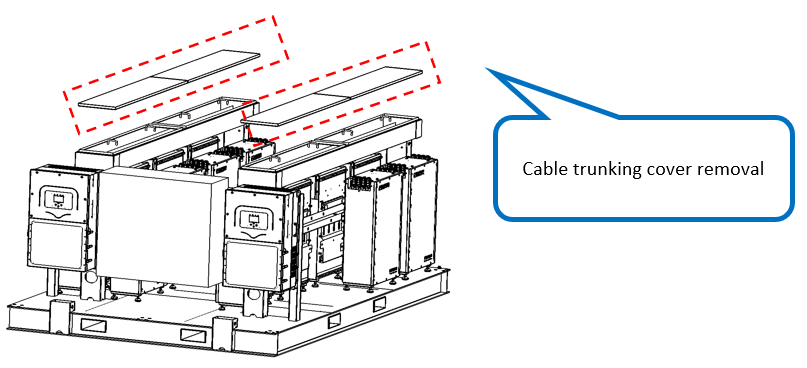
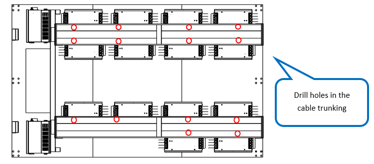

# 6. Open Cable Trunking

**Process Name**: Cable trunking opening

**Tools / PPE**: Long cloth strips, Φ35 or larger hole saw, hand drill

**Parts List**
| Part No. | Part Name | Qty |
| --- | --- | --- |
|  | Cable trunking | 2 |

**Steps**

1. Cover each row of batteries with long cloth strips to prevent metal shavings from falling, as shown in Figure 1.

   

2. Remove all trunking covers as shown in Figure 2.

	

3. Drill cable holes in the trunking above the batteries according to the actual routing. Hole position and size depend on cable routing and diameter, as shown in Figure 3.

	

**Notes**

> 1. Place cloth strips on the batteries to prevent metal shavings from dropping.
> 2. Keep hole size consistent and aligned for neat routing.
