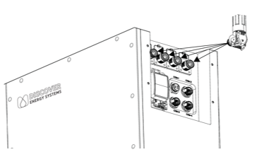
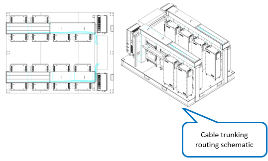
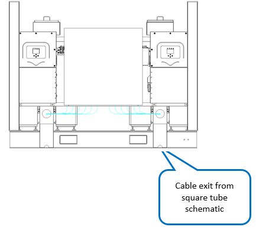

# 7. Wiring - Battery Power Cables

**Process Name**: Battery power cable routing

**Tools / PPE**: Scissors, 3M gloves, electric screwdriver (Phillips), marker

**Parts List**
| Part No. | Part Name | Qty |
| --- | --- | --- |
| 120000-022 | PACK1 positive cable | 1 |
| 120000-023 | PACK1 negative cable | 1 |
| 120000-024 | PACK2 positive cable | 1 |
| 120000-025 | PACK2 negative cable | 1 |
| 120000-026 | PACK3 positive cable | 1 |
| 120000-027 | PACK3 negative cable | 1 |
| 120000-028 | PACK4 positive cable | 1 |
| 120000-029 | PACK4 negative cable | 1 |
| 120000-030 | PACK5 positive cable | 1 |
| 120000-031 | PACK5 negative cable | 1 |
| 120000-032 | PACK6 positive cable | 1 |
| 120000-033 | PACK6 negative cable | 1 |
| 120000-034 | PACK7 positive cable | 1 |
| 120000-035 | PACK7 negative cable | 1 |
| 120000-036 | PACK8 positive cable | 1 |
| 120000-037 | PACK8 negative cable | 1 |
| 120000-038 | PACK9 positive cable | 1 |
| 120000-039 | PACK9 negative cable | 1 |
| 120000-040 | PACK10 positive cable | 1 |
| 120000-041 | PACK10 negative cable | 1 |
| 120000-042 | PACK11 positive cable | 1 |
| 120000-043 | PACK11 negative cable | 1 |
| 120000-044 | PACK12 positive cable | 1 |
| 120000-045 | PACK12 negative cable | 1 |
| 120000-046 | PACK13 positive cable | 1 |
| 120000-047 | PACK13 negative cable | 1 |
| 120000-048 | PACK14 positive cable | 1 |
| 120000-049 | PACK14 negative cable | 1 |

**Steps**

1. Verify all materials per BOM and ensure no damage.

2. Connect the cable start ends to the battery packs as shown in Figure 1, and press into the matching connectors.

   

3. Route cables in the trunking as shown in Figure 2.

   

4. Connect cable end to the busbar, torque 50N.m.

5. See drawings ESTZ-0026 and ESTZ-0027.

   

**Notes**

> 1. All connectors must be fully seated.
> 2. All screws must be tightened with no omissions or insufficient torque.
> 3. After wiring, complete all test items according to the test outline.
