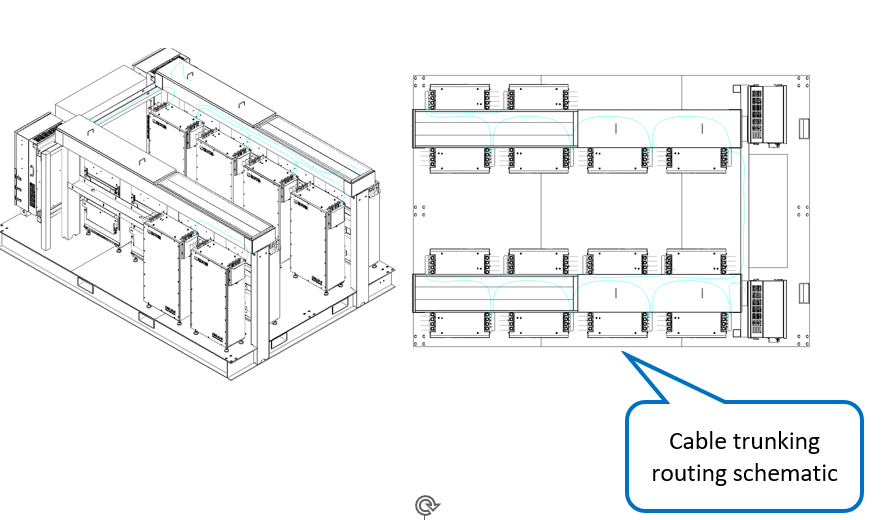

# 8. Wiring - Battery Communication Cables

**Process Name**: Battery communication cable routing

**Tools / PPE**: 3M gloves

**Parts List**
| Part No. | Part Name | Qty |
| --- | --- | --- |
| 120000-050 | PACK1-PACK2 comm cable | 1 |
| 120000-051 | PACK2-PACK3 comm cable | 1 |
| 120000-052 | PACK3-PACK4 comm cable | 1 |
| 120000-053 | PACK4-PACK5 comm cable | 1 |
| 120000-054 | PACK5-PACK6 comm cable | 1 |
| 120000-055 | PACK6-PACK7 comm cable | 1 |
| 120000-056 | PACK7-PACK8 comm cable | 1 |
| 120000-057 | PACK8-PACK9 comm cable | 1 |
| 120000-058 | PACK9-PACK10 comm cable | 1 |
| 120000-059 | PACK10-PACK11 comm cable | 1 |
| 120000-060 | PACK11-PACK12 comm cable | 1 |
| 120000-061 | PACK12-PACK13 comm cable | 1 |
| 120000-062 | PACK13-PACK14 comm cable | 1 |
| 120000-063 | PACK14-LYNK II comm cable | 1 |

**Steps**

1. Verify all materials per BOM and ensure no damage.

2. Connect the cable start ends to the battery packs as shown in Figure 1, and press into the matching connectors.

   

3. Route cables in the trunking as shown in Figure 2.

   

4. Connect the cable end to LINK II in the NEXUS as shown in Figure 3.

5. See drawings ESTZ-0026 and ESTZ-0033.

   

**Notes**

> 1. All connectors must be fully seated.
> 2. All screws must be tightened with no omissions or insufficient torque.
> 3. After wiring, complete all test items according to the test outline.
