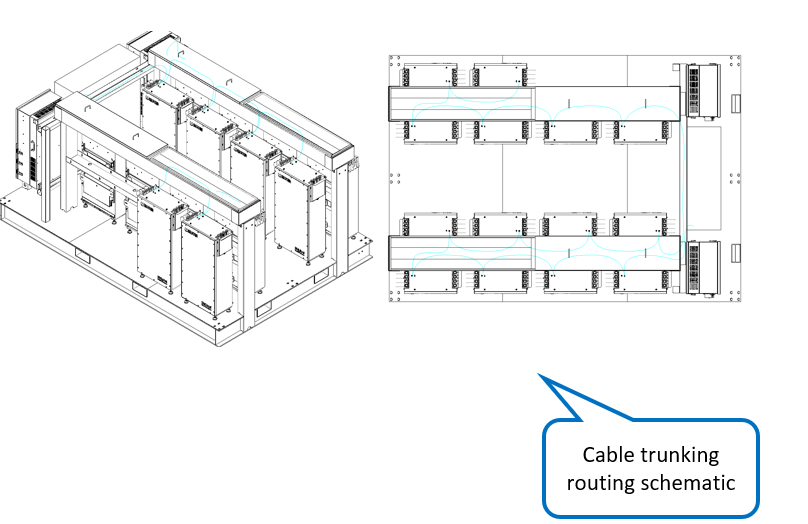

# 9. Wiring - Battery Grounding Cables

**Process Name**: Battery grounding cable routing

**Tools / PPE**: Scissors, 3M gloves, electric screwdriver (Phillips), marker

**Parts List**
| Part No. | Part Name | Qty |
| --- | --- | --- |
| 120000-064 | PACK grounding cable | 1 |
| 120000-065 | PACK1-PACK2 grounding cable | 1 |
| 120000-066 | PACK2-PACK3 grounding cable | 1 |
| 120000-067 | PACK3-PACK4 grounding cable | 1 |
| 120000-068 | PACK4-PACK5 grounding cable | 1 |
| 120000-069 | PACK5-PACK6 grounding cable | 1 |
| 120000-070 | PACK6-PACK7 grounding cable | 1 |
| 120000-071 | PACK7-PACK8 grounding cable | 1 |
| 120000-072 | PACK8-PACK9 grounding cable | 1 |
| 120000-073 | PACK9-PACK10 grounding cable | 1 |
| 120000-074 | PACK10-PACK11 grounding cable | 1 |
| 120000-075 | PACK11-PACK12 grounding cable | 1 |
| 120000-076 | PACK12-PACK13 grounding cable | 1 |
| 120000-077 | PACK13-PACK14 grounding cable | 1 |

**Steps**

1. Verify all materials per BOM and ensure no damage.

2. Connect grounding cables between packs as shown in Figure 1, torque 10N.m.

   

3. Route cables in the trunking as shown in Figure 2.

   

4. Connect grounding cable end to the grounding busbar in NEXUS, torque 10N.m, as shown in Figure 3.

   <!--  -->

5. See drawings ESTZ-0026 and ESTZ-0035.

**Notes**

> 1. One grounding point needs to connect two lugs.
> 2. All screws must be tightened with no omissions or insufficient torque.
> 3. After wiring, complete all test items according to the test outline.
