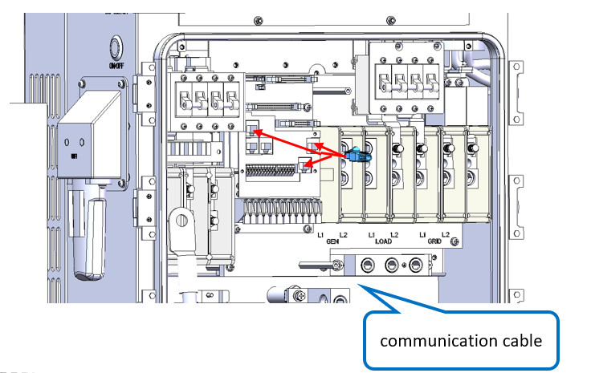
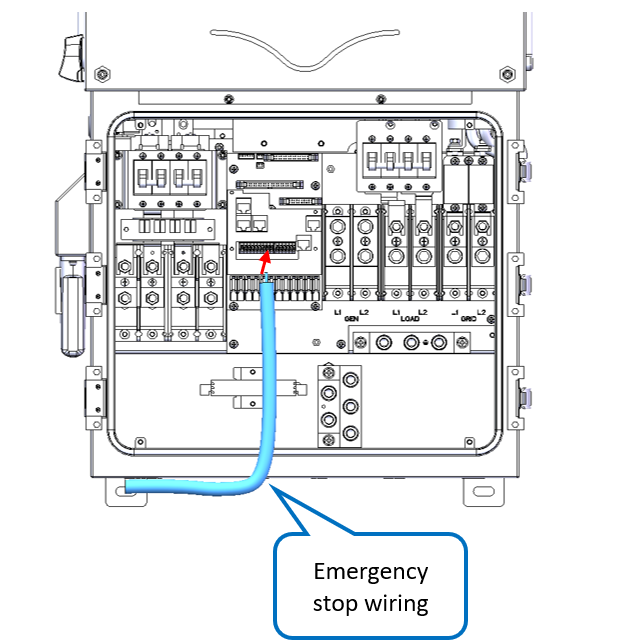
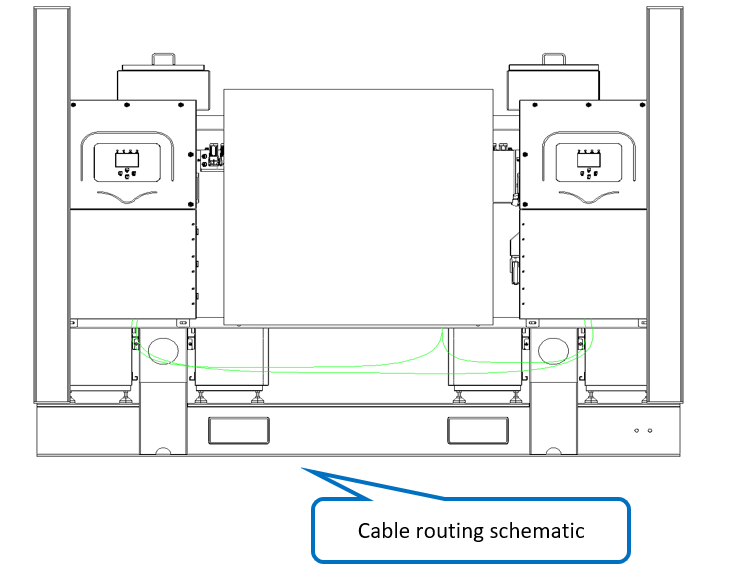

# 10. Wiring - Inverter Comm Cables

**Process Name**: Inverter communication cable routing

**Tools / PPE**: Scissors, 3M gloves, electric screwdriver (Phillips), marker

| Part No. | Part Name | Qty |
| --- | --- | --- |
| 120000-102 | INV parallel cable | 1 |
| 120000-103 | INV1-LYNK II comm cable | 1 |
| 120000-104 | INV1-ECU comm cable | 1 |
| 120000-105 | INV2-ECU comm cable | 1 |
| 120000-106 | INV1-ECU emergency stop cable | 1 |
| 120000-107 | INV2-ECU emergency stop cable | 1 |

**Steps**

1. Verify all materials per BOM and ensure no damage.

2. Connect communication cables as shown in Figure 1 and press into the matching connectors.

   

3. Connect emergency stop cable start end as shown in Figure 2.

   

4. Connect emergency stop cable end as shown in Figure 3.

   

5. Route external cables as shown in Figure 4.

   

6. See drawing ESTZ-0037.

**Notes**

> 1. The INV1-LYNK II comm cable needs trimming. Pay attention to pin numbers.
> 2. All connectors must be fully seated with no misalignment.
> 3. After wiring, complete all test items according to the test outline.
> 4. Wiring is the same for both inverters.
