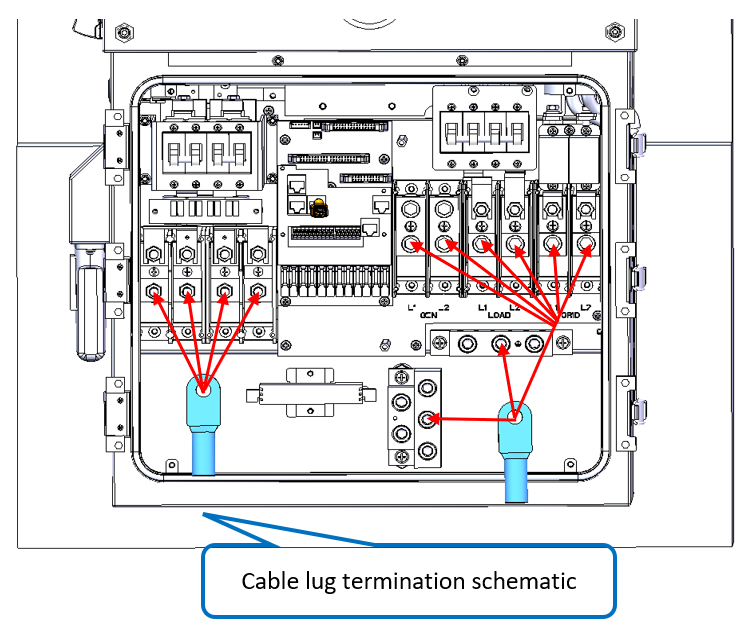
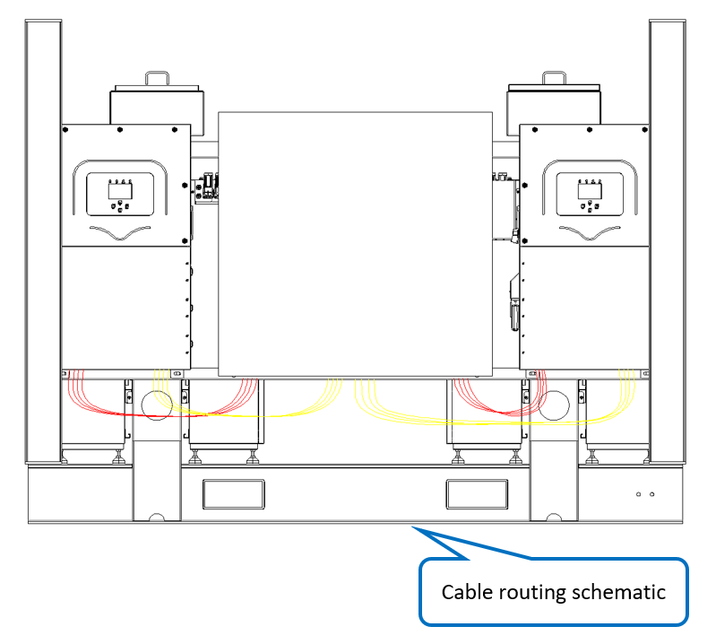

# 11. Wiring - Inverter Power Cables

**Process Name**: Inverter power cable routing

**Tools / PPE**: Scissors, 3M gloves, electric screwdriver (socket), marker

**Parts List**
| Part No. | Part Name | Qty |
| --- | --- | --- |
| 120000-078 | INV1 battery positive cable | 1 |
| 120000-079 | INV1 battery positive cable | 1 |
| 120000-080 | INV1 battery negative cable | 1 |
| 120000-081 | INV1 battery negative cable | 1 |
| 120000-082 | INV2 battery positive cable | 1 |
| 120000-083 | INV2 battery positive cable | 1 |
| 120000-084 | INV2 battery negative cable | 1 |
| 120000-085 | INV2 battery negative cable | 1 |
| 120000-086 | INV1 DG L1 cable | 1 |
| 120000-087 | INV1 DG L2 cable | 1 |
| 120000-088 | INV1 load L1 cable | 1 |
| 120000-089 | INV1 load L2 cable | 1 |
| 120000-090 | INV1 grid L1 cable | 1 |
| 120000-091 | INV1 grid L2 cable | 1 |
| 120000-092 | INV1 earth cable | 1 |
| 120000-093 | INV1 neutral cable | 1 |
| 120000-094 | INV2 DG L1 cable | 1 |
| 120000-095 | INV2 DG L2 cable | 1 |
| 120000-096 | INV2 load L1 cable | 1 |
| 120000-097 | INV2 load L2 cable | 1 |
| 120000-098 | INV2 grid L1 cable | 1 |
| 120000-099 | INV2 grid L2 cable | 1 |
| 120000-100 | INV2 earth cable | 1 |
| 120000-101 | INV2 neutral cable | 1 |

**Steps**

1. Verify all materials per BOM and ensure no damage.

2. Connect cable lugs as shown in Figure 1. Remove the nut, align the lug with the hole, then tighten the nut, torque 10N.m.

   

3. Route external cables as shown in Figure 2.

   

4. See drawing ESTZ-0037.

**Notes**

> 1. All lug connections must be fully tightened with no omissions or insufficient pressure.
> 2. Follow the busbar wiring sequence strictly as shown in the drawings.
> 3. After wiring, complete all test items according to the test outline.
> 4. Wiring is the same for both inverters.
