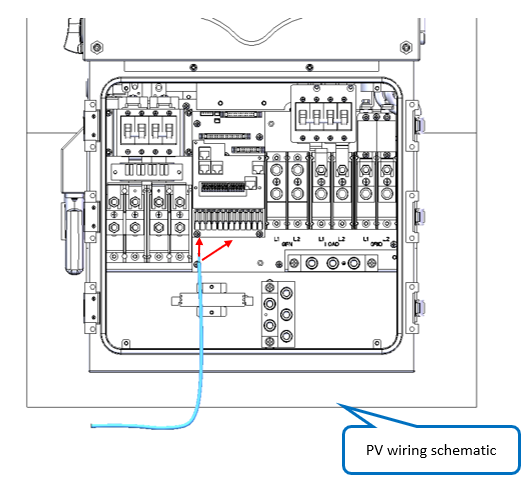
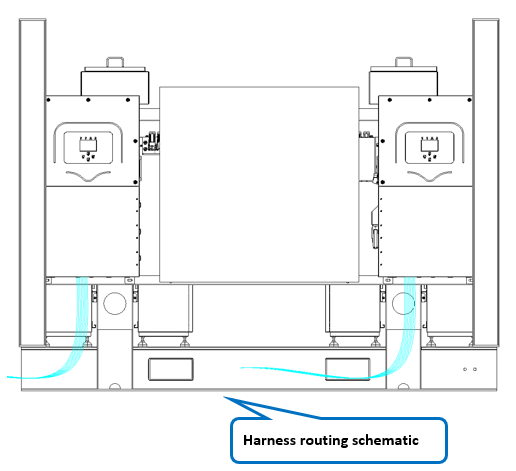

# 12. Wiring - PV Cables

**Process Name**: PV cable routing

**Tools / PPE**: Scissors, 3M gloves, marker

**Parts List**
| Part No. | Part Name | Qty |
| --- | --- | --- |
| 120000-001 | PV positive cable 1 |      |
| 120000-002 | PV negative cable 1 |      |
| 120000-003 | PV positive cable 2 |      |
| 120000-004 | PV negative cable 2 |      |
| 120000-005 | PV positive cable 3 |      |
| 120000-006 | PV negative cable 3 |      |
| 120000-007 | PV positive cable 4 |      |
| 120000-008 | PV negative cable 4 |      |
| 120000-009 | PV positive cable 5 |      |
| 120000-010 | PV negative cable 5 |      |
| 120000-011 | PV positive cable 6 |      |
| 120000-012 | PV negative cable 6 |      |
| 120000-013 | PV positive cable 7 |      |
| 120000-014 | PV negative cable 7 |      |
| 120000-015 | PV positive cable 8 |      |
| 120000-016 | PV negative cable 8 |      |

**Steps**

1. Verify all materials per BOM and ensure no damage.

2. The cable start ends are already connected to PV panels. Connect the other ends to inverters as shown in Figure 1.

   

3. Route external cables as shown in Figure 2.

   

4. See drawing ESTZ-0037.

**Notes**

> 1. Trim cable ends so that 10mm copper is exposed. Use lugs if needed.
> 2. All inverter connections must be fully tightened with no omissions or insufficient pressure.
> 3. After wiring, complete all test items according to the test outline.
