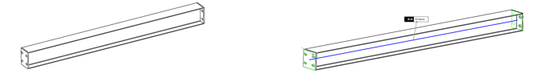
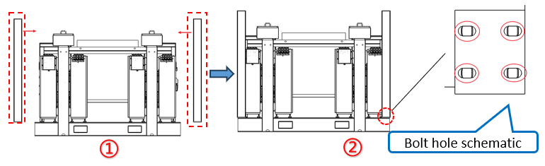
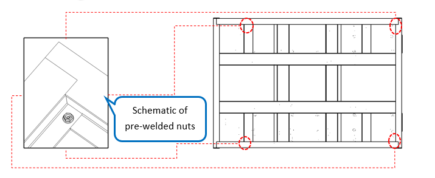

# 13. Install Columns

**Process Name**: Skid canopy column installation

**Tools / PPE**: Electric wrench + 18mm socket, high-torque wrench, marker

**Parts List**
| Part No. | Part Name | Qty |
| --- | --- | --- |
| B1309900491 | Column | 4 |
|             | M12 hex flange bolt | 16 |
|             | M12 hex flange nut | 12 |

**Steps**

1. The skid uses 4 columns, each 1516mm long, as shown in Figure 1.

   

2. Place the columns on the skid and align the holes as shown in Figure 2① and Figure 2②.

   

3. Fasten columns with M12×40 hex flange bolts (A2-70 stainless) in sequence. Pre-tighten with an electric wrench, then tighten to 120N.m with a torque wrench. Mark bolts and nuts with a black line, as shown in Figure 4.

   

**Notes**

> 1. Each corner of the skid has four bolt holes. One inner hole has a pre-welded M12 nut for installation convenience, as shown in Figure 3.
>
>    
>
> 2. All bolts must be fully tightened with no omissions or insufficient torque.
