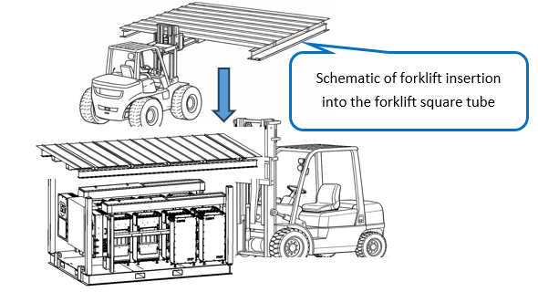
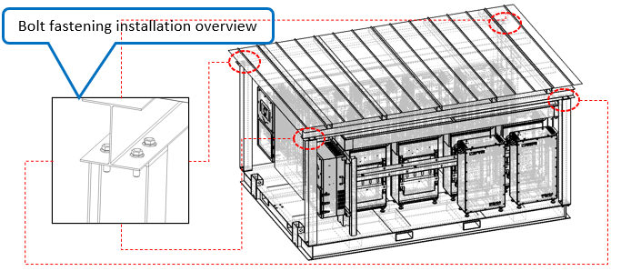

# 14. Install Steel Roof Canopy

**Process Name**: Steel roof canopy installation

**Equipment**: Forklift

**Tools / PPE**: Electric wrench + 19mm socket, high-torque wrench, marker

**Parts List**
| Part No. | Part Name | Qty |
| --- | --- | --- |
|          | Steel roof canopy | 1 |
|          | M12 hex flange bolt | 16 |
|          | M12 hex flange nut | 16 |

**Steps**

1. The steel roof canopy comes with forklift square tubes, as shown in Figure 1.

   

2. Use a forklift to assist installation as shown in Figure 2.

   

3. Align canopy holes with column holes. For each column, use four M12×40 hex flange bolts (A2-70 stainless), pre-tighten with an electric wrench, then tighten to 88N.m with a torque wrench. Mark bolts and nuts with a black line, as shown in Figure 3.

   

**Notes**

> 1. During forklift handling, keep a 1m safety zone around the lifting area. Keep the forklift running until all bolts are pre-tightened. Operators must follow safety protection rules.
> 2. All bolts must be fully tightened with no omissions or insufficient torque.
