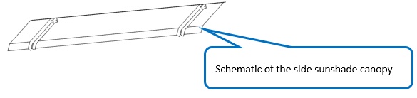
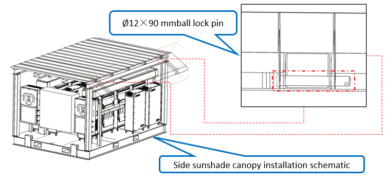

# 15. Install Side Canopies

**Process Name**: Side canopy installation

**Tools / PPE**: Rubber gloves, safety helmet, safety shoes

**Parts List**
| Part No. | Part Name | Qty |
| --- | --- | --- |
|          | Side canopy | 2 |
|          | Steel ball pin 12x90 | 4 |

**Steps**

1. Side canopies on the skid, as shown in Figure 1.

   

2. Align the side canopy pin holes with the square tube holes on the steel roof canopy. Insert steel ball pins (12x90) into both holes as shown in Figure 2.

   

**Notes**

> 1. The stainless steel sheet edges are sharp. Operators must wear proper protection.
> 2. Ensure the steel ball pins are fully inserted.
> 3. Do not lift the side canopy flat to avoid deformation.
