## 1.拆解彩钢瓦遮阳棚

**工序名称**：彩钢瓦遮阳顶棚拆除

**设备**：叉车

**工具/劳保用品**：电动扳手+19mm套筒、高扭矩扳手、记号笔

**零件列表**	
| 零件编码 | 零件名称 | 数量 |
| --- | --- | --- |
|  | 彩钢瓦遮阳顶棚 | 1 |
|  | M12外六角法兰螺栓 | 16 |
|  | M12外六角法兰螺母 | 16 |

**作业步骤**

1. 将四根立柱上的4颗不锈钢材质M12*40法兰外六角螺栓A2-70等级，按照顺序使用电动扳手完成所有螺栓拆除，如图1所示；

	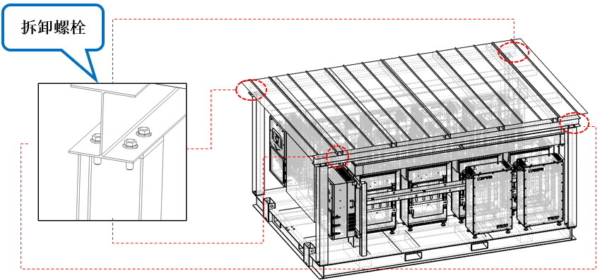

2. 叉车叉遮阳顶棚上的叉车方管，然后把遮阳棚升起。如图2所示；

	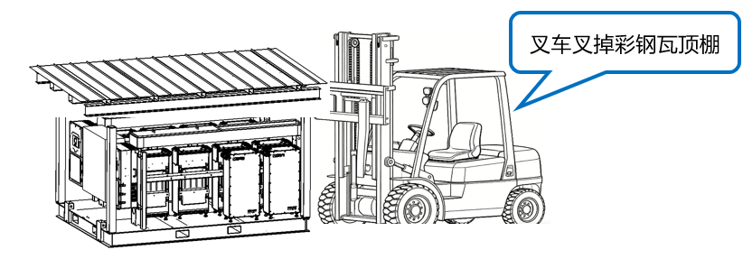

3. 彩钢瓦遮阳顶棚放到安全位置。如图3所示；

	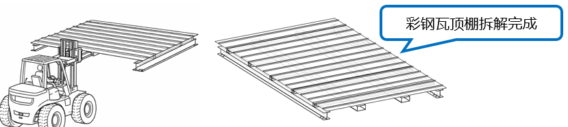

**注意事项**

>1. 叉车叉运遮阳棚过程中，叉运区域周围1米范围内禁止人员停留。在所有连接螺栓解除预紧之前叉车应保持运行状态不得提升叉齿。螺栓拆除作业过程中，作业人员须严格做好安全防护。
>2. 螺钉需全部拆除到位，叉车才可提升作业。

## 2.立柱拆解 

**工序名称**：托盘遮阳棚立柱拆除

**工具/劳保用品**：电动扳手+18mm套筒、高扭矩扳手、记号笔

**零件列表**

| 零件编号 | 零件名称 | 数量 |
| --- | --- | --- |
| B1309900491 | 立柱 | 4 |
|  | M12外六角法兰螺栓 | 16 |
|  | M12外六角法兰螺母 | 12 |

**作业步骤**

1. 托盘上共计需使用4根立柱，每根立柱长度1516mm。如图1①所示；

2. 立柱螺栓拆除：如图1②所示，共使用4颗不锈钢材质M12*40法兰外六角螺栓A2-70等级，按照顺序使用电动扳手完成所有螺栓拆除。

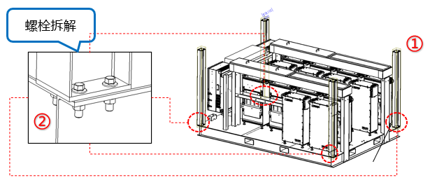

3. 立柱拆除：将立柱由托盘上取下如图2所示；

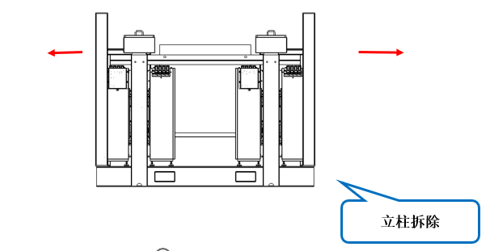

**注意事项**

> 1. 托盘安装面四角各设有4个螺栓孔位，其中靠近托盘内部的一个孔位因现场安装不便，已预先焊接M12螺母，不需要拆除。

## 3.电池安装

**工序名称**：电池安装

**工具/劳保用品**：电动扳手（配12mm的套筒）、十字螺丝刀、高扭矩扳手、记号笔

**零件列表**

| 零件编号 | 零件名称 | 数量 |
| --- | --- | --- |
|  | 电池安装板 | 14 |
|  | 电池 | 14 |
|  | M10x25外六角法兰螺栓 | 28 |
|  | M5X12螺钉 | 56 |

**作业步骤**	

1. 电池安装板安装：

   1. 首先先把电池安装板的安装孔与支架安装孔对齐，如图1①所示；
   2. 使用M10x25外六角法兰螺栓对电池安装板两个位置紧固，如图1②所示；

   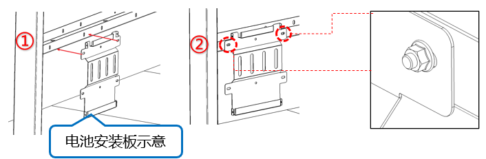

2. 电池安装：

   1. ①首先把电池抱到与电池安装板孔对齐，如图2①所示；

   2. ②使用M5X12螺钉分别在四个位置对电池固定，如图2②所示；

   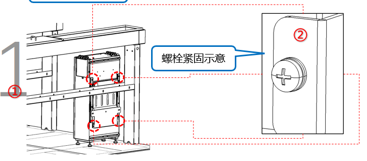

**注意事项**

> 1. 托盘总共有16个电池安装位置，但是只需要安装14个电池即可，如图三所示；
> 2. 螺钉需全部紧固到位，不得遗漏和扭力不足；

## 4.逆变器安装

**工序名称**：逆变器安装
**工具/劳保用品**：电动扳手（配10mm的套筒）、高扭矩扳手、记号笔

**零件列表**	

| 零件编码 | 零件名称 | 数量 |
| --- | --- | --- |
|  | 逆变器 | 2 |
|  | M8x25外六角法兰螺栓 | 4 |
|  | M8x25外六角法兰螺母 | 4 |

**作业步骤**	

1. 挂置逆变器：把逆变器挂到上面支架安装槽上，如图1所示；

   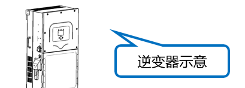

2. 逆变器安装孔对齐：挂置完成后下面逆变器安装孔与下面支架槽安装孔对齐，如图2所示；

   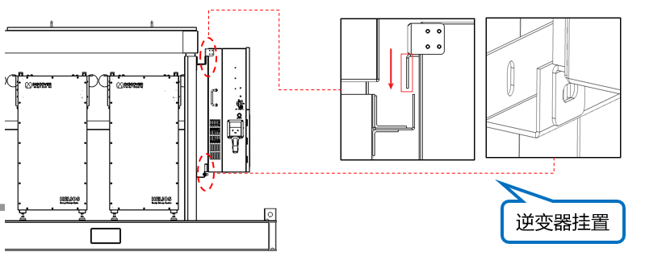

3. 紧固逆变器螺栓：使用M10外六角法兰螺栓对逆变器固定，扭矩42Nm，如图3所示；

   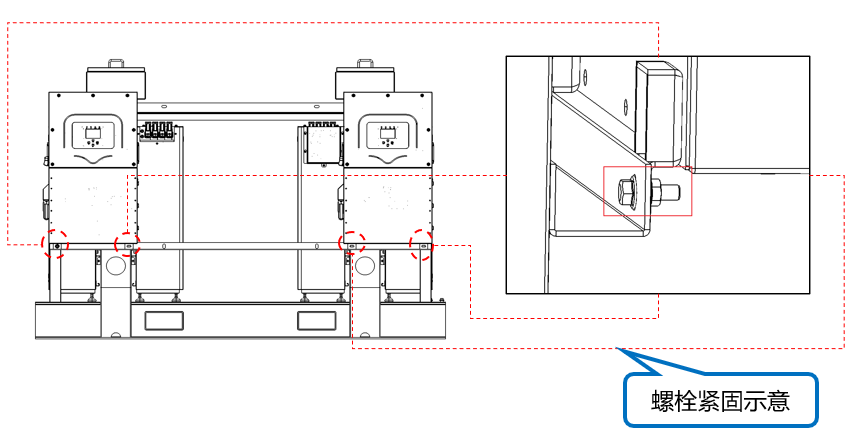

**注意事项**

> 1. 挂置逆变器时注意挂钩与上安装槽内扣在一起，避免挂空掉落。
> 2. 螺钉需全部紧固到位，不得遗漏和扭力不足。

## 5.Bos箱安装

**工序名称**：BOS箱安装

**工具/劳保用品**：电动扳手+18mm套筒、高扭矩扳手、记号笔

**零件列表**

| 零件编码 | 零件名称 | 数量 |
| --- | --- | --- |
|  | BOS箱 | 1 |
|  | M12外六角法兰螺栓 | 4 |

## 6.线槽开孔

**工序名称**：线槽开口
**工具/劳保用品**：长条布、Φ35及以上开孔钻头、手电钻

**零件列表**	

| 零件编码 | 零件名称 | 数量 |
| --- | --- | --- |
|  | 线槽 | 2 |

**作业步骤**

1. 首先在每列电池上方盖上长条布，为了接下来开孔防止铁屑乱飞做好措施。如图1所示；

   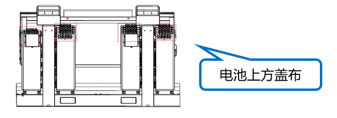

2. 把线槽盖全部取下来，如图2所示；

	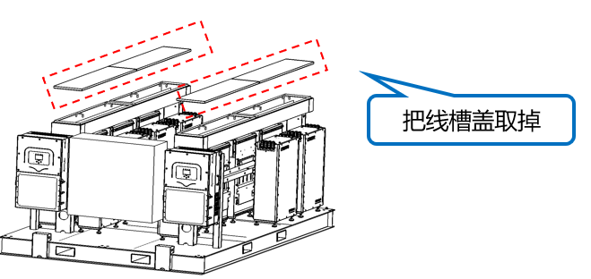

3. 根据电池实际布线走线去灵活在电池上方的线槽内开走线孔，开孔位置根据实际走线位置工作人员自行决断，开孔大小根据线径大小决定。如图3所示；

	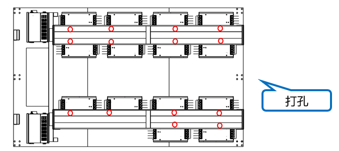

**注意事项**

> 1. 在打孔的时候再下方电池上面垫上长条布，防止铁屑掉落在电池上面。
> 2. 在线槽打孔时为了美观与实际作用要尽量保持孔径大小一致和保持一条直线上。

## 7.布线-电池动力线

**工序名称**：布线-电池动力线

**工具/劳保用品**：剪刀、3M手套、电批（十字）、记号笔

**零件列表**

| 零件编码 | 零件名称 | 数量 |
| --- | --- | --- |
| 120000-022 | PACK1正极线 | 1 |
| 120000-023 | PACK1负极线 | 1 |
| 120000-024 | PACK2正极线 | 1 |
| 120000-025 | PACK2负极线 | 1 |
| 120000-026 | PACK3正极线 | 1 |
| 120000-027 | PACK3负极线 | 1 |
| 120000-028 | PACK4正极线 | 1 |
| 120000-029 | PACK4负极线 | 1 |
| 120000-030 | PACK5正极线 | 1 |
| 120000-031 | PACK5负极线 | 1 |
| 120000-032 | PACK6正极线 | 1 |
| 120000-033 | PACK6负极线 | 1 |
| 120000-034 | PACK7正极线 | 1 |
| 120000-035 | PACK7负极线 | 1 |
| 120000-036 | PACK8正极线 | 1 |
| 120000-037 | PACK8负极线 | 1 |
| 120000-038 | PACK9正极线 | 1 |
| 120000-039 | PACK9负极线 | 1 |
| 120000-040 | PACK10正极线 | 1 |
| 120000-041 | PACK10负极线 | 1 |
| 120000-042 | PACK11正极线 | 1 |
| 120000-043 | PACK11负极线 | 1 |
| 120000-044 | PACK12正极线 | 1 |
| 120000-045 | PACK12负极线 | 1 |
| 120000-046 | PACK13正极线 | 1 |
| 120000-047 | PACK13负极线 | 1 |
| 120000-048 | PACK14正极线 | 1 |
| 120000-049 | PACK14负极线 | 1 |

**作业步骤**

1. 根据BOM点齐所有物料，确保无损坏；

2. 线缆初始端与电池包连接按图1所示，找到对应接口直接按压入内；

   

3. 根据图纸按照图2进行线槽走线；

   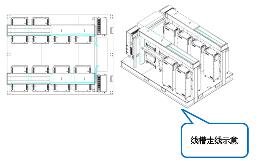

4. 线缆终止端与汇流铜排相连，扭矩50N.m；

5. 详情见图纸ESTZ-0026、ESTZ-0027。

   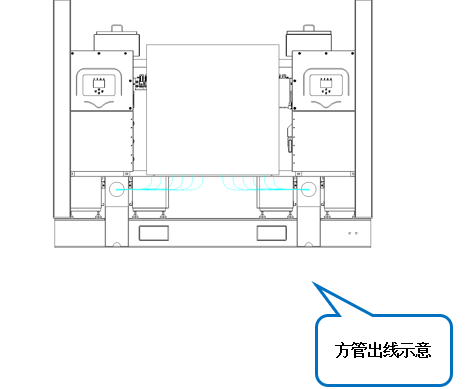

**注意事项**

> 1. 每个接插件都需要压接到位;
> 2. 螺丝需全部紧固到位，不得遗漏和扭力不足;
> 3. 接线完成后，需要根据测试大纲，通过所有测试项目。

## 8.布线-电池通讯线

**工序名称**：布线-电池动力线

**工具/劳保用品**：3M手套

**零件列表**	

| 120000-050 | PACK1-PACK2 通讯线   | 1    |
| ---------- | -------------------- | ---- |
| 120000-051 | PACK2-PACK3 通讯线   | 1    |
| 120000-052 | PACK3-PACK4 通讯线   | 1    |
| 120000-053 | PACK4-PACK5 通讯线   | 1    |
| 120000-054 | PACK5-PACK6 通讯线   | 1    |
| 120000-055 | PACK6-PACK7 通讯线   | 1    |
| 120000-056 | PACK7-PACK8 通讯线   | 1    |
| 120000-057 | PACK8-PACK9 通讯线   | 1    |
| 120000-058 | PACK9-PACK10 通讯线  | 1    |
| 120000-059 | PACK10-PACK11 通讯线 | 1    |
| 120000-060 | PACK11-PACK12 通讯线 | 1    |
| 120000-061 | PACK12-PACK13 通讯线 | 1    |
| 120000-062 | PACK13-PACK14 通讯线 | 1    |
| 120000-063 | PACK14-LYNKⅡ 通讯线  | 1    |

**作业步骤**

1. 根据BOM点齐所有物料，确保无损坏；

2. 线缆初始端与电池包连接按图1所示，找到对应接口直接按压入内；

   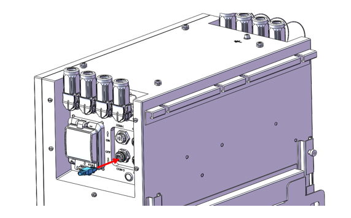

3. 根据图纸按照图2进行线槽走线；

   

4. 线缆终止端与NEXUS中的LINK Ⅱ相连按图3所示，找到对应接口直接按压入内；

   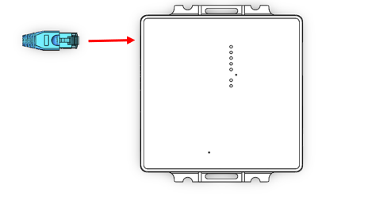

5. 详情见图纸ESTZ-0026、ESTZ-0033。

   

**注意事项**

> 1. 每个接插件都需要压接到位;
> 2. 螺丝需全部紧固到位，不得遗漏和扭力不足;
> 3. 接线完成后，需要根据测试大纲，通过所有测试项目。

## 9.布线-电池接地线

**工序名称**：布线-电池动力线

**工具/劳保用品**：剪刀、3M手套、电批（十字）、记号笔

**零件列表**

| 零件编码   | 零件名称             | 数量 |
| ---------- | -------------------- | ---- |
| 120000-064 | PACK接地线           | 1    |
| 120000-065 | PACK1-PACK2 接地线   | 1    |
| 120000-066 | PACK2-PACK3 接地线   | 1    |
| 120000-067 | PACK3-PACK4 接地线   | 1    |
| 120000-068 | PACK4-PACK5 接地线   | 1    |
| 120000-069 | PACK5-PACK6 接地线   | 1    |
| 120000-070 | PACK6-PACK7 接地线   | 1    |
| 120000-071 | PACK7-PACK8 接地线   | 1    |
| 120000-072 | PACK8-PACK9 接地线   | 1    |
| 120000-073 | PACK9-PACK10 接地线  | 1    |
| 120000-074 | PACK10-PACK11 接地线 | 1    |
| 120000-075 | PACK11-PACK12 接地线 | 1    |
| 120000-076 | PACK12-PACK13 接地线 | 1    |
| 120000-077 | PACK13-PACK14 接地线 | 1    |

**作业步骤**	

1. 根据BOM点齐所有物料，确保无损坏；

2. pack之间的接地线连接按图1所示，扭矩10N.m；

   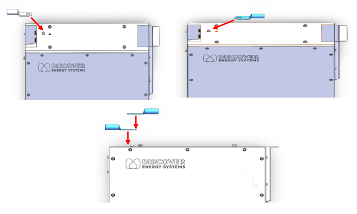

3. 根据图纸按照图2进行线槽走线；

   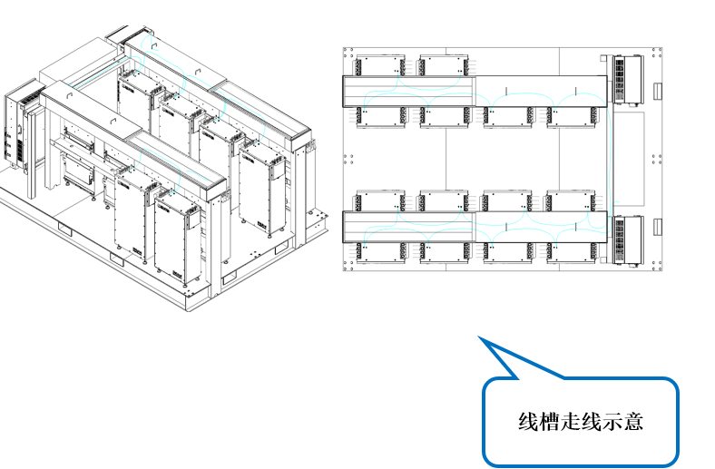

4. 接地线终止端与NEXUS中的接地铜排相连按图3所示，扭矩10N.m；

   

5. 详情见图纸ESTZ-0026、ESTZ-0035。

**注意事项**

> 1. 一个接地端需要需要连接两个铜鼻子;
> 2. 螺丝需全部紧固到位，不得遗漏和扭力不足;
> 3. 接线完成后，需要根据测试大纲，通过所有测试项目。

## 10.布线-逆变器接线-通讯线

**工序名称**：布线-电池动力线

**工具/劳保用品**：剪刀、3M手套、电批（十字）、记号笔

| 零件编码   | 零件名称          | 数量 |
| ---------- | ----------------- | ---- |
| 120000-102 | INV并机线         | 1    |
| 120000-103 | INV1-LYNKⅡ 通讯线 | 1    |
| 120000-104 | INV1-ECU 通讯线   | 1    |
| 120000-105 | INV2-ECU 通讯线   | 1    |
| 120000-106 | INV1-ECU 急停线   | 1    |
| 120000-107 | INV2-ECU 急停线   | 1    |

**作业步骤**

1. 根据BOM点齐所有物料，确保无损坏；

2. 通讯线接插方式如图1所示，根据图纸找到对应接口直接按压入内；

   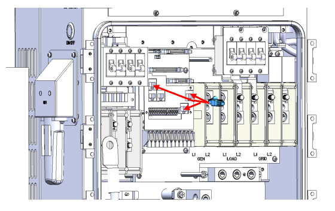

3. 急停线起始端接线如图2所示，根据图纸找到对应接口插入；

   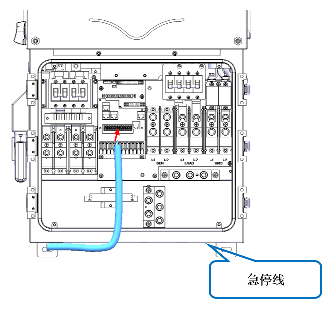

4. 急停线终止端接线如图3所示；

   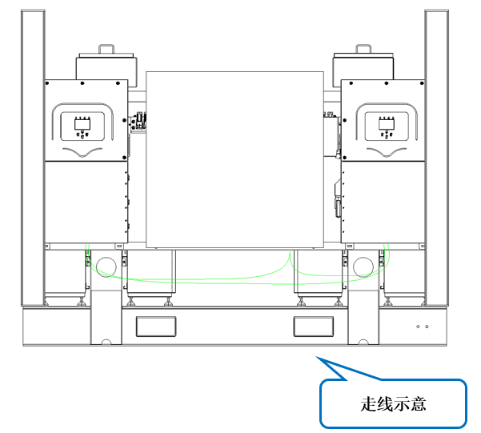

5. 外部走线方式如图4所示；

   

6. 详情见图纸ESTZ-0037。

**注意事项**

> 1. INV1-LYNKⅡ通讯线需要裁剪，注意引脚号;
> 2. 每个接插件都需要压接到位，接口无错位;
> 3. 接线完成后，需要根据测试大纲，通过所有测试项目；
> 4. 两台逆变器接线方式相同。

## 11.布线-逆变器接线-电源线

**工序名称**：布线-电池动力线

**工具/劳保用品**：剪刀、3M手套、电批（套筒）、记号笔

**零件列表**

| 零件编码   | 零件名称       | 数量 |
| ---------- | -------------- | ---- |
| 120000-078 | INV1电池正极线 | 1    |
| 120000-079 | INV1电池正极线 | 1    |
| 120000-080 | INV1电池负极线 | 1    |
| 120000-081 | INV1电池负极线 | 1    |
| 120000-082 | INV2电池正极线 | 1    |
| 120000-083 | INV2电池正极线 | 1    |
| 120000-084 | INV2电池负极线 | 1    |
| 120000-085 | INV2电池负极线 | 1    |
| 120000-086 | INV1 柴发L1线  | 1    |
| 120000-087 | INV1 柴发L2线  | 1    |
| 120000-088 | INV1 负载L1线  | 1    |
| 120000-089 | INV1 负载L2线  | 1    |
| 120000-090 | INV1 电网L1线  | 1    |
| 120000-091 | INV1 电网L2线  | 1    |
| 120000-092 | INV1 接电线    | 1    |
| 120000-093 | INV1 零线      | 1    |
| 120000-094 | INV2 柴发L1线  | 1    |
| 120000-095 | INV2 柴发L2线  | 1    |
| 120000-096 | INV2 负载L1线  | 1    |
| 120000-097 | INV2 负载L2线  | 1    |
| 120000-098 | INV2 电网L1线  | 1    |
| 120000-099 | INV2 电网L2线  | 1    |
| 120000-100 | INV2 接电线    | 1    |
| 120000-101 | INV2 零线      | 1    |

**作业步骤**

1. 根据BOM点齐所有物料，确保无损坏；

2. 铜鼻子连接位置如图1所示，先取出螺母，再对准孔位放入铜鼻子，最后将螺母拧紧，扭矩10N.m；

   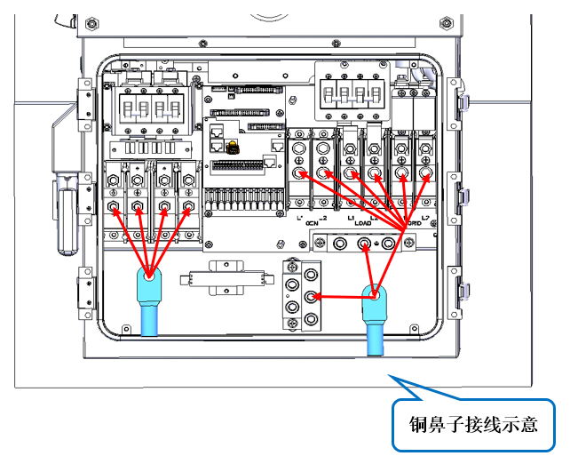

3. 按照图2进行外部走线；

   

4. 详情见图纸ESTZ-0037。

**注意事项**

> 1. 铜鼻子连接端全部紧固到位，不得遗漏和按压不足;
> 2. 铜排接线顺序需严格按图纸所示;
> 3. 接线完成后，需要根据测试大纲，通过所有测试项目。
> 4. 两台逆变器接线方式相同。

## 12.布线-光伏线

**工序名称**：布线-电池动力线

**工具/劳保用品**：剪刀、3M手套、记号笔

**零件列表**

| 零件编码   | 零件名称    | 数量 |
| ---------- | ----------- | ---- |
| 120000-001 | 光伏正极线1 |      |
| 120000-002 | 光伏负极线1 |      |
| 120000-003 | 光伏正极线2 |      |
| 120000-004 | 光伏负极线2 |      |
| 120000-005 | 光伏正极线3 |      |
| 120000-006 | 光伏负极线3 |      |
| 120000-007 | 光伏正极线4 |      |
| 120000-008 | 光伏负极线4 |      |
| 120000-009 | 光伏正极线5 |      |
| 120000-010 | 光伏负极线5 |      |
| 120000-011 | 光伏正极线6 |      |
| 120000-012 | 光伏负极线6 |      |
| 120000-013 | 光伏正极线7 |      |
| 120000-014 | 光伏负极线7 |      |
| 120000-015 | 光伏正极线8 |      |
| 120000-016 | 光伏负极线8 |      |

**作业步骤**

1. 根据BOM点齐所有物料，确保无损坏；

2. 光伏线起始端已与光伏板相连，终止端与逆变器的连接按图1所示；

   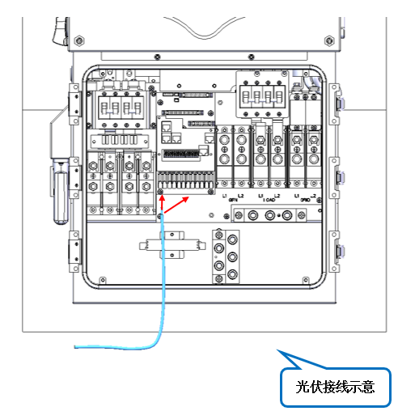

3. 按照图2进行外部走线；

   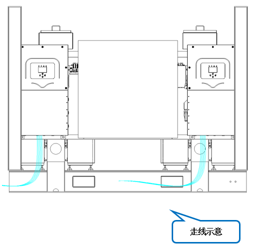

4. 详情见图纸ESTZ-0037。

**注意事项**

> 1. 光伏线终止端需要进行裁剪，保证铜丝露出达到10mm，必要时可以采用铜鼻子连接;
> 2. 逆变器连接端全部紧固到位，不得遗漏和按压不足;
> 3. 接线完成后，需要根据测试大纲，通过所有测试项目。

## 13.立柱安装 

**工序名称**：托盘遮阳棚立柱安装

**工具/劳保用品**：电动扳手+18mm套筒、高扭矩扳手、记号笔

**零件列表**

| 零件编码    | 零件名称          | 数量 |
| ----------- | ----------------- | ---- |
| B1309900491 | 立柱              | 4    |
|             | M12外六角法兰螺栓 | 16   |
|             | M12外六角法兰螺母 | 12   |

**作业步骤**

1. 托盘上共计需使用4根立柱，每根立柱长度1516mm。如图1所示；

   

2. 立柱放置：将立柱放置到托盘上如图2①所示，将立柱孔位与托盘固定孔位对齐，如图2②所示；

   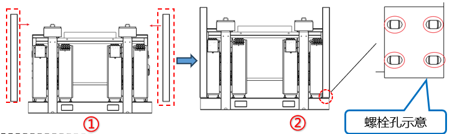

3. 立柱固定：如图4所示，共使用4颗不锈钢材质M12*40法兰外六角螺栓A2-70等级，按照顺序完成所有孔位预紧安装，使用电动扳手预紧螺栓，再用扭矩扳手紧固，扭矩120N.m，在螺栓及螺母处用记号笔划画黑色线标记防松记号。

   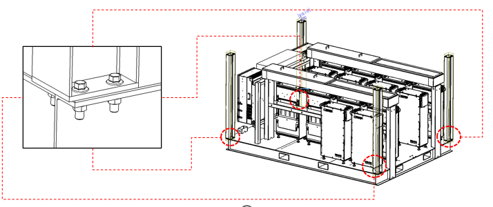

**注意事项**

> 1. 托盘安装面四角各设有4个螺栓孔位，其中靠近托盘内部的一个孔位因现场安装不便，已预先焊接M12螺母，如图3所示；
>
>    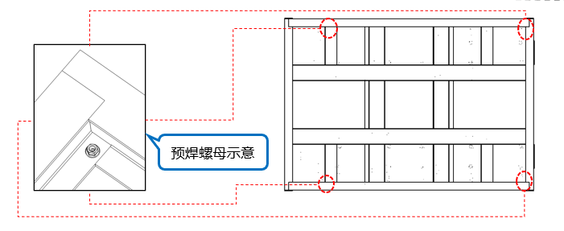
>
> 2. 螺钉需全部紧固到位，不得遗漏和扭力不足。

## 14.彩钢瓦顶棚安装

**工序名称**：彩钢瓦遮阳顶棚安装

**工具/劳保用品**：电动扳手+19mm套筒、高扭矩扳手、记号笔

**零件列表**

| 零件编码 | 零件名称          | 数量 |
| -------- | ----------------- | ---- |
|          | 彩钢瓦遮阳顶棚    | 1    |
|          | M12外六角法兰螺栓 | 16   |
|          | M12外六角法兰螺母 | 16   |

**作业步骤**

1. 彩钢瓦遮阳顶棚自带叉车方管。如图1所示；

   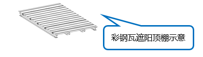

2. 叉车辅助安装遮阳顶棚。如图2所示；

   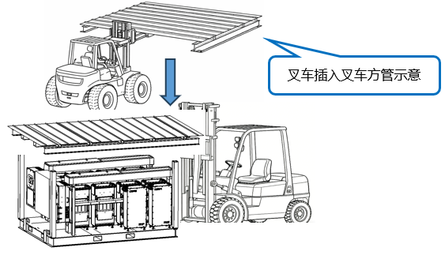

3. 将遮阳棚固定孔位与立柱安装孔对齐，四根立柱分别使用4颗不锈钢材质M12*40法兰外六角螺栓A2-70等级，按照顺序完成所有孔位预紧安装，使用电动扳手预紧螺栓，再用扭矩扳手紧固，扭矩88N.m，在螺栓及螺母处用记号笔划画黑色线标记防松记号。如图3所示；

   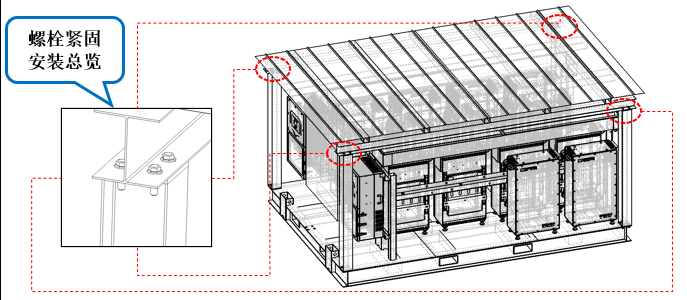

**注意事项**

> 1. 叉车叉运遮阳棚过程中，叉运区域周围1米范围内禁止人员停留。遮阳棚就位后，叉车应保持运行状态，在所有连接螺栓完成预紧固之前不得离位。螺栓预紧作业过程中，作业人员须严格做好安全防护。
> 2. 螺钉需全部紧固到位，不得遗漏和扭力不足。

## 15.遮阳侧边棚安装

**工序名称**：遮阳侧边棚安装

**工具/劳保用品**：橡胶手套、安全帽、劳保鞋

**零件列表**

| 零件编码 | 零件名称    | 数量 |
| -------- | ----------- | ---- |
|          | 遮阳侧边棚  | 2    |
|          | 钢珠销12X90 | 4    |

**作业步骤**

1. 托盘遮阳侧边棚。如图1所示；

   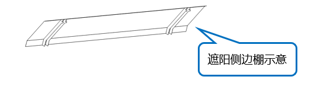

2. 遮阳侧边棚安装：将遮阳侧边棚销轴孔位与彩钢瓦顶棚侧边方管安装孔对齐，两处销轴孔对齐后分别插入钢珠销12X90。如图2所示；

   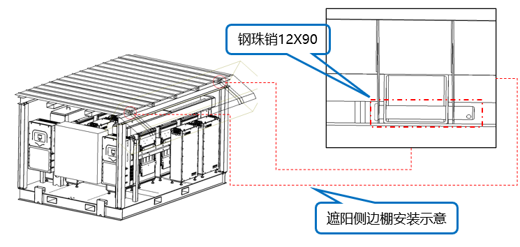

**注意事项**

> 1. 遮阳侧边棚时不锈钢薄板材质较为锋利，作业人员须严格做好安全防护。
> 2. 钢柱销需完全插入到位。
> 3. 注意抬动侧边遮阳棚时不要平抬不然会导致变形。
